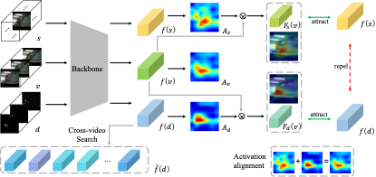

# Dual Contrastive Learning for Spatio-temporal Representation
Official pytorch implementation of our ACM MM 2022 paper [Dual Contrastive Learning for Spatio-temporal Representation.](https://dl.acm.org/doi/abs/10.1145/3503161.3547783)

## Overview
Contrastive learning in the video domain exists severe background bias. When naively pulling two augmented views of a video closer, the model however tends to learn the common static background as a shortcut but fails to capture the motion information, a phenomenon dubbed as background bias. To tackle this challenge, this paper presents a novel dual contrastive formulation. Concretely, we decouple the input RGB video sequence into two complementary modes, static scene and dynamic motion. Then, the original RGB features are pulled closer to the static features and the aligned dynamic features, respectively. In this way, the static scene and the dynamic motion are simultaneously encoded into the compact RGB representation. We further conduct the feature space decoupling via activation maps to distill static- and dynamic-related features. We term our method as Dual Contrastive Learning for spatio-temporal Representation (DCLR). 



## Usage

### Requirements
- pytroch >= 1.8.1
- tensorboard
- cv2
- kornia

### Data preparation
- Download the Kinetics400 dataset from the [official website](https://deepmind.com/research/open-source/kinetics).
- Download the UCF101 dataset from the [official website](https://www.crcv.ucf.edu/data/UCF101.php).


### Pretrain
In default, we train backbone R(2+1)D on UCF101 on a single node with 8 gpus for 200 epochs. 
```python
python main_view.py \
  --log_dir base_moco_r2d_view_ucf \
  --ckp_dir base_moco_r2d_view_ucf \
  --dataset ucf101 \
  -a r2plus1d_18 \
  --lr 0.01 \
  -cs 112 \
  -fpc 16 \
  -b 40 \
  -j 16 \
  --epochs 201 \
  --schedule 120 160 \
  --aug_plus \
  --mlp \
  --dist-url 'tcp://localhost:10001' --multiprocessing-distributed --world-size 1 --rank 0 \
  $path/dataset/ucf-101
```

### Action Recognition Downstream Evaluation
In default, we finetune backbone R(2+1)D on UCF101 on a single node with 4 gpus.
```python
python -W ignore main_lincls.py \
  --log_dir log_finetune_18_ucf \
  --ckp_dir log_finetune_18_ucf \
  -a r2plus1d_18 \
  --num_class 101 \
  --lr 0.1 \
  --lr_decay 0.1 \
  --wd 0.0001 \
  -fpc 16 \
  -cpv 10 \
  -b 64 \
  -j 32 \
  --finetune \
  --pretrained $path_to_checkpoint_0199.pth.tar \
  --epochs 10 \
  --schedule 6 8 \
  --dist-url 'tcp://localhost:10001' --multiprocessing-distributed --world-size 1 --rank 0 \
  $path/dataset/ucf-101
```

## Acknowledgement
Our code is based on the implementation of [VideoMoCo](https://github.com/tinapan-pt/VideoMoCo) and [MoCo](https://github.com/facebookresearch/moco). We sincerely thanks those authors for their great works.


## Citation
If our code is helpful to your work, please consider citing:
```
@inproceedings{ding2022dual,
  title={Dual contrastive learning for spatio-temporal representation},
  author={Ding, Shuangrui and Qian, Rui and Xiong, Hongkai},
  booktitle={Proceedings of the 30th ACM International Conference on Multimedia},
  pages={5649--5658},
  year={2022}
}
```


